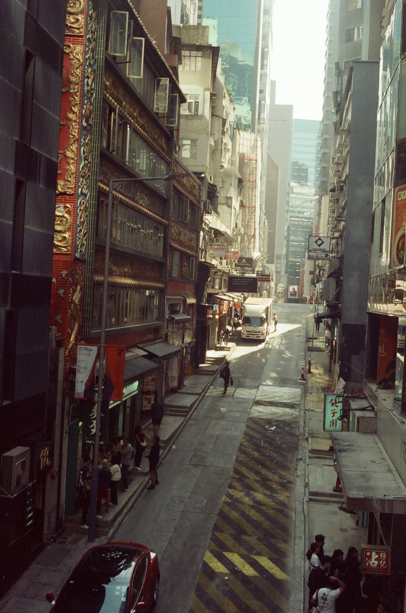
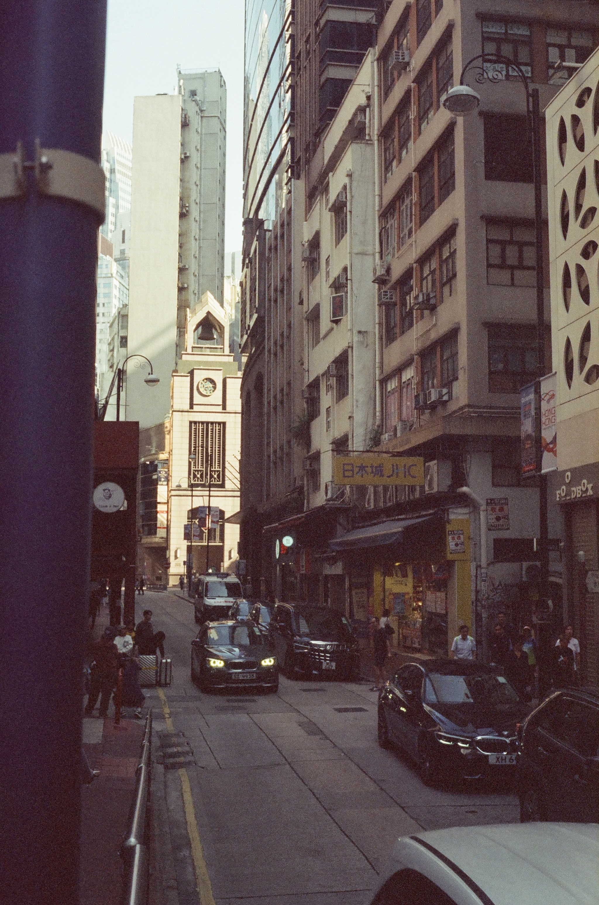
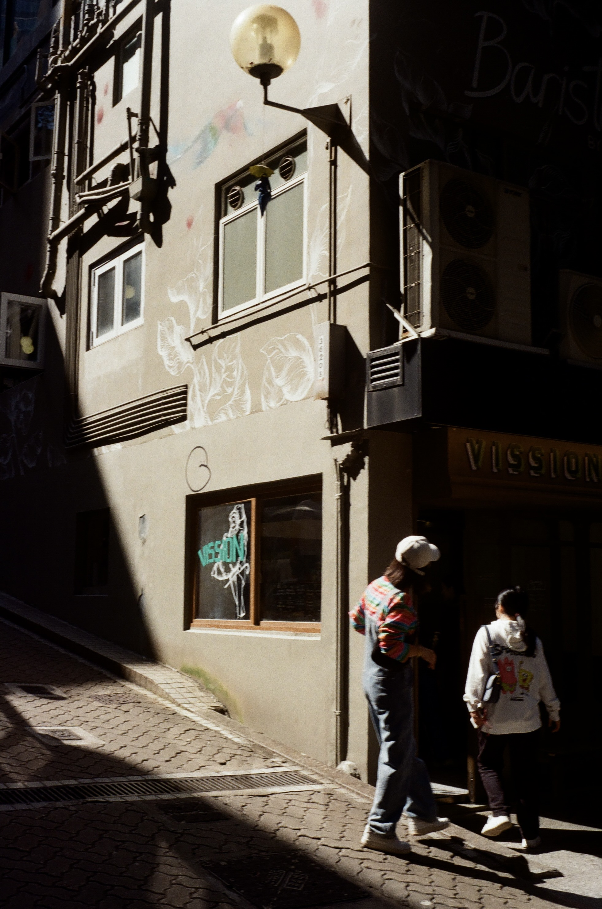
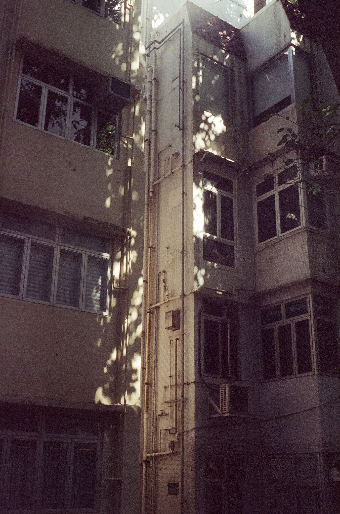
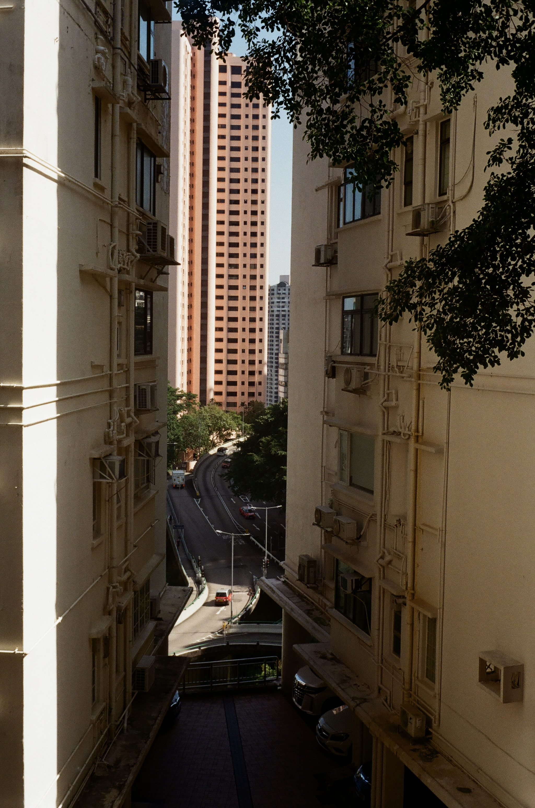
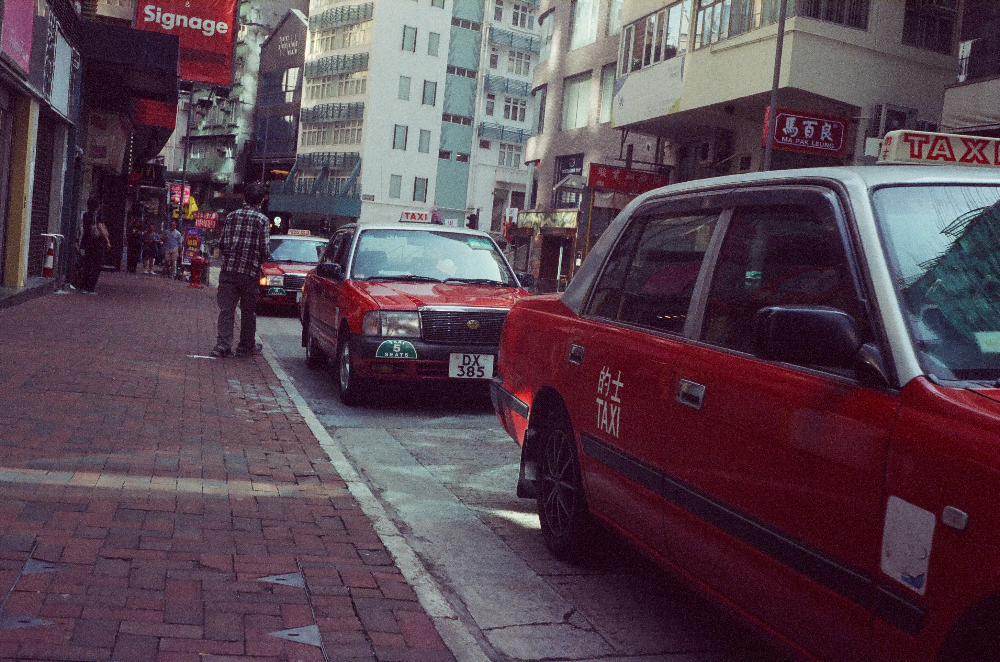
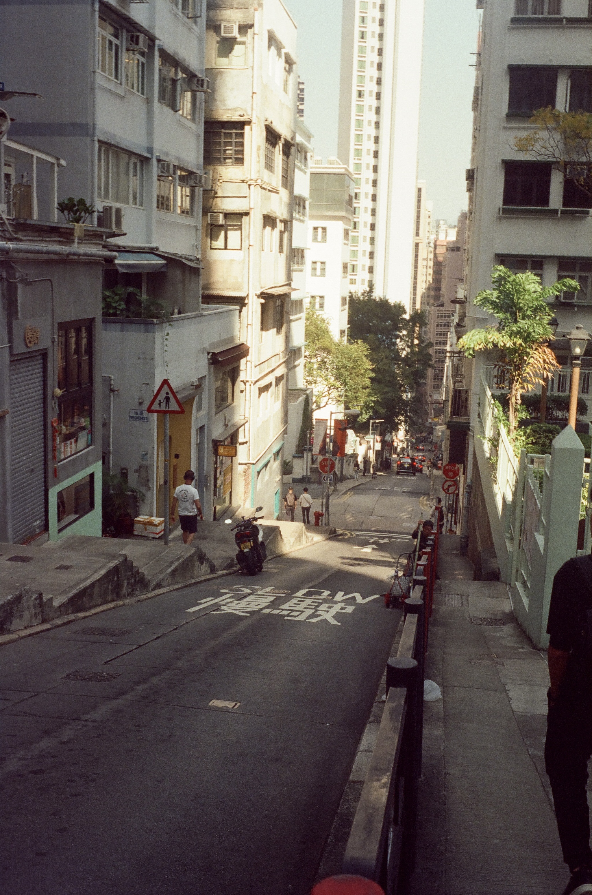
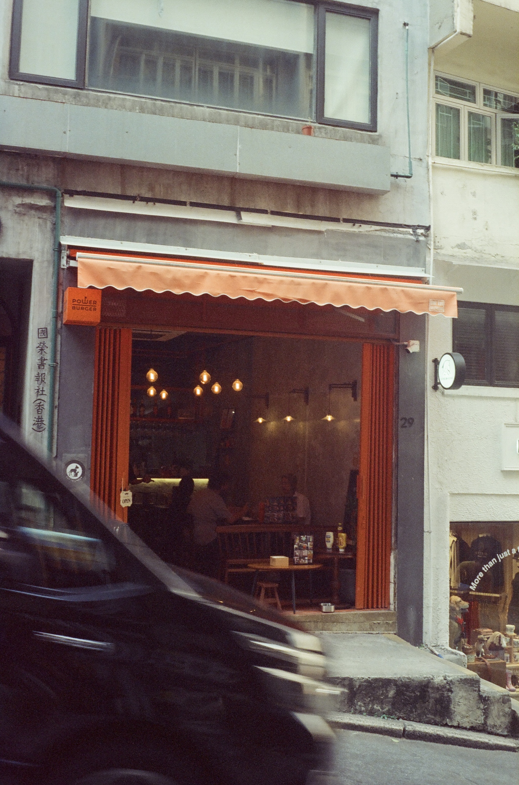
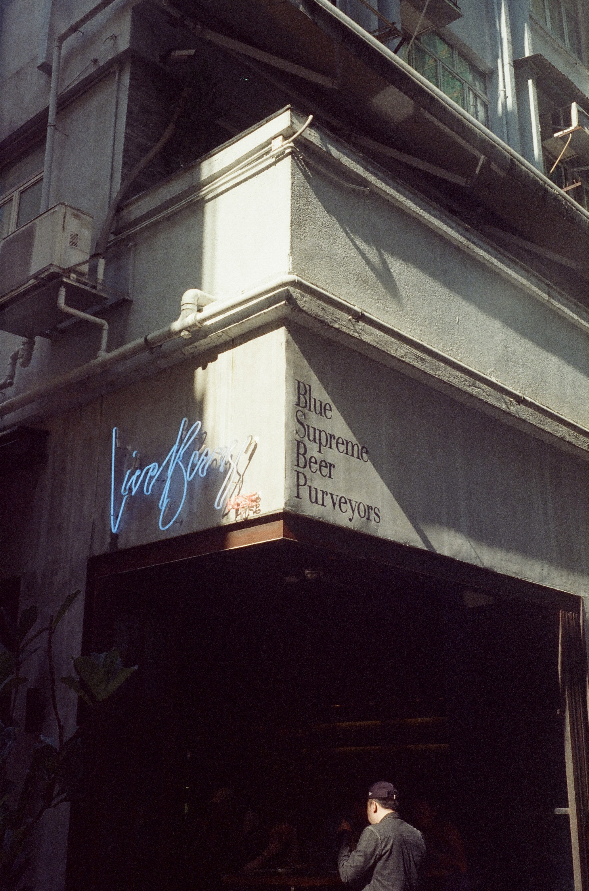

홍콩 미드레벨에서 찍은 몇몇 사진들 (물론 베스트 컷)

[//]: <> (이 거리에 Tsim Chai Kee Noodle 이라는 국수집이 있는데 완전 강추.)

[//]: <> (미드레벨 에스컬레이터를 타고 올라가다 보면 나오는 골목 중 하나에 있는 Halfway Coffee Mid-Levels라는 카페에서 찍은 사진. 야외 카페인데 분위기가 너무 좋다.)

[//]: <> (이 Power Burger라는 버거집도 맛있다.)

